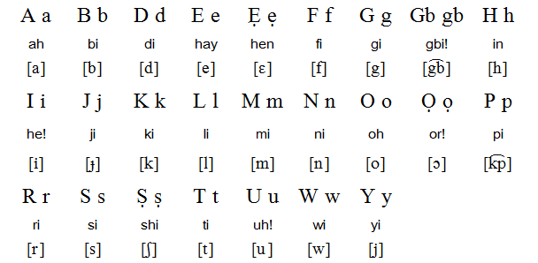

# Yoru.A.I.

A deeplearning4j project trained to recognise alphabets in one of the s\*xiest languages in Africa. the Yoruba Alphabet. well to be honest Yoruba is one of the razzest languages on the globe but that's not to say it isn't s\*xy, to prove this point that's why Africa has a lot of Yoruba demonds(cheating bastards who do it so well) scattered all over the globe. Any attempt by the reader
to google these demonds are at the sole descretion of the reader also I strongly advise you against making contact with those of them that 
live in Nigeria or have anything to do with that country(All it takes is a second to break a girl's heart, they are really that good). nof said let's get dirty. 

## The S\*xy Alphabets

These awesome letters at times when used by African demonds in their snakey inauguration operations may be 
some times referred to as the YoruPhalbet.

## Quick Links
 
 - training data
 - audio files
 - 

> Despite the unverifiable truths discussed above the aim of this library is to demonstrate how to train a 
> Convolutional Neural Network model from scratch using the deeplearning4j framework.
